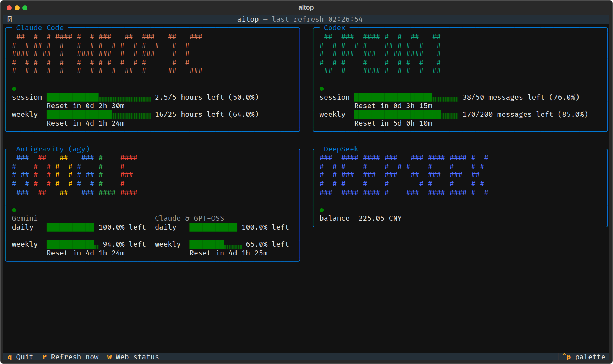
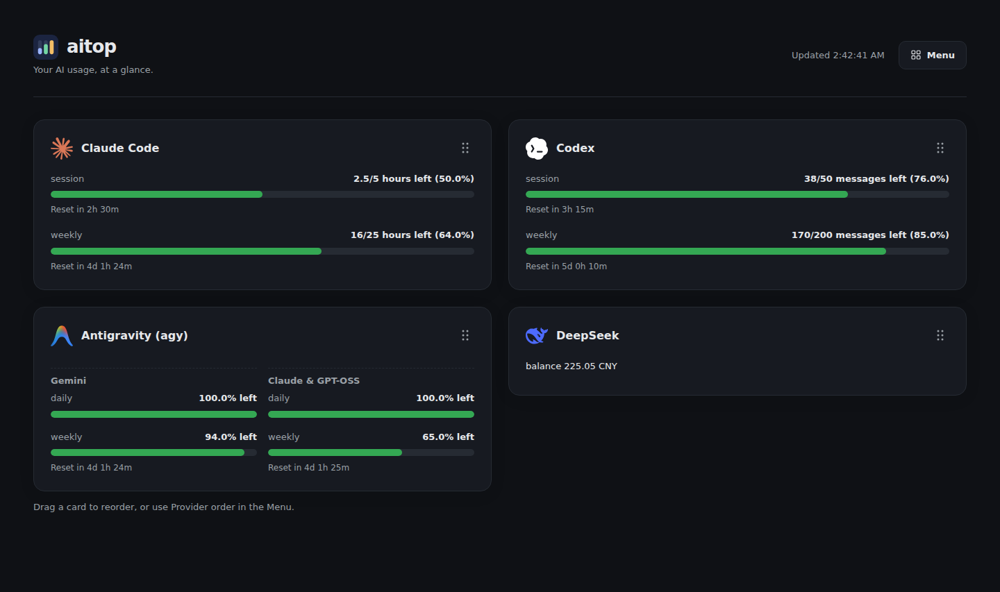

# aitop

Monitor **Claude Code, Codex, Antigravity (agy), and DeepSeek** from your terminal or browser. See remaining quota, reset countdowns, and account balances in one place.

See the [v1.0 release notes](CHANGELOG.md) for highlights and upgrade instructions.

## Install

Requires **Python 3.11+**. From the repository root:

```bash
python -m venv .venv
source .venv/bin/activate
pip install -e .
aitop --mock
```

Demo mode needs no credentials or provider CLIs. For live data, complete the [provider setup](#provider-setup) below.

## TUI

```bash
aitop                    # live dashboard
aitop --mock             # demo data
aitop --no-web           # terminal only, even if web is enabled in config
```



*Terminal dashboard with demo data.*

Use **q** to quit, **r** to refresh, and **w** to view the web server status. The grid supports fixed positions or automatic resizing.

Both interfaces show **quota left**: 25% used becomes **75% left**. Bars turn amber at 30% remaining and red below 10%. Session timers show `2h 30m`; other windows show `4d 1h 24m`. Failed fetches retain the last good values, marked **stale**; missing values show **no data**.

## Web

```bash
aitop --web              # web dashboard alongside the TUI
aitop --headless          # web dashboard only
aitop --headless --mock   # web demo
```

Open **http://localhost:8787**. The web server is off by default.



*Web dashboard with demo data.*

- **Menu:** turn providers on/off, set a DeepSeek API key, choose a grid, and reorder cards. Toggle Antigravity's Claude & GPT-OSS group; its remaining Gemini group needs no extra title. Author, version, and GitHub are also listed here.
- **Drag cards** to reorder and save immediately. Grips support touch and arrow keys.
- **Save settings** keeps Menu changes in the active `config.toml`, shared across browsers and restarts. Closing the Menu cancels its preview.

The dashboard refreshes at the configured interval; `/api/snapshots` provides the data as JSON. Hover over a reset timer to see its original note. Reload the page after restarting the service before saving settings.

The server binds to `127.0.0.1` by default, or `0.0.0.0` under WSL2 for Windows localhost forwarding. It has **no login authentication**; keep it on a trusted network.

To run automatically when WSL starts, follow the [service setup guide](docs/wsl.md). When the service is running, use `aitop --no-web` for a separate TUI to avoid a port conflict.

## Provider setup

| Provider | Required setup | Data source |
|---|---|---|
| Claude Code | `claude` on `PATH`, already logged in | CLI `/usage` |
| Codex | `codex` on `PATH`, already logged in | CLI `/status` |
| Antigravity | `agy` CLI on `PATH`, already logged in | CLI `/usage`, including both quota groups |
| DeepSeek | API key saved through **Menu**, or `DEEPSEEK_API_KEY` | HTTPS balance API |

Run each CLI once to log in before starting aitop. The `agy` CLI is required for Antigravity; the desktop app alone is insufficient. DeepSeek shows an account balance rather than a quota bar.

CLI data is parsed from terminal output. Expired logins or changes to vendor screens may produce **no data**. Reopen the relevant CLI and check its login and usage screen; aitop does not log in or refresh credentials for you.

## Configuration

Use `aitop --config path/to/config.toml` to select a file. Otherwise aitop reads `./config.toml`, then `~/.config/aitop/config.toml`, creating the latter on first run if neither exists.

```toml
refresh_interval_s = 30
show_remaining = true
reset_countdown = true

[layout]
adaptive = true

[web]
enabled = false
port = 8787
```

Set `show_remaining = false` for usage bars, or `reset_countdown = false` for native reset notes. Web-specific overrides, provider positions, timeouts, and grid settings are covered in the [configuration reference](docs/configuration.md).

Provider switches control both display and polling. Saved DeepSeek keys stay in the local config with owner-only permissions and are never returned to the browser.

Restart aitop after editing the file. Changes saved through the Web Menu apply immediately.

## Development

```bash
pip install -e ".[dev]"
python -m pytest -q
```

See [screenshot instructions](docs/screenshots.md) to refresh the demo images. The TUI uses [Textual](https://github.com/Textualize/textual); provider logos come from [Lobe Icons](https://github.com/lobehub/lobe-icons), with the [MIT attribution](src/aitop/static/LICENSE.txt) included.
